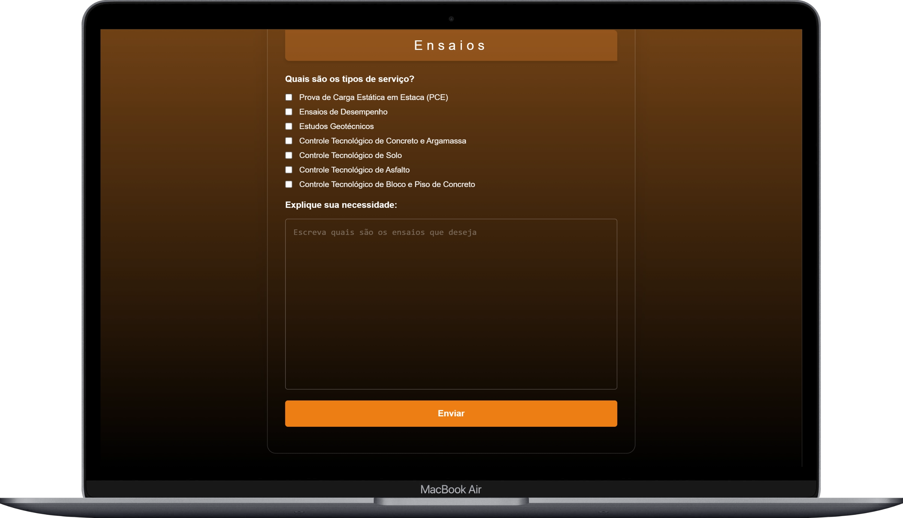

# 📄 Sistema de Solicitação de Propostas – TECNOL


> Sistema web desenvolvido para **solicitação de propostas técnicas**, com geração automática de **PDF** e envio por **e-mail via SMTP**, utilizado pela **TECNOL Tecnologia**.

---

## ✨ Funcionalidades

- 📋 Formulário completo de solicitação de proposta
- 🧼 Validação e sanitização de dados no backend
- 🗺️ Coleta de informações de localização e serviços
- 📄 Geração automática de proposta em **PDF (DOMPDF)**
- ✉️ Envio do PDF por e-mail usando **PHPMailer (SMTP)**
- 🕒 Data e hora corretas no padrão brasileiro
- 🎨 Interface moderna com identidade visual da TECNOL

---

## 🧱 Tecnologias Utilizadas

- **PHP 8+**
- **Composer**
- **PHPMailer** (envio de e-mails SMTP)
- **DOMPDF** (geração de PDFs)
- **HTML5 / CSS3 / JavaScript**
- **Laragon** (ambiente de desenvolvimento local)

---

## 📁 Estrutura do Projeto

```
/proposta
├── index.html              # Formulário de solicitação
├── processar-form.php      # Validação, geração do PDF e envio do e-mail
├── config-email.php        # Configurações SMTP
├── template-pdf.php        # Template HTML do PDF
├── /vendor                 # Dependências (Composer)
├── composer.json
└── README.md
```

---

## 🖥️ Screenshots

## Formulário – Informações do Cliente



<br/>


## Formulário – Informações do Cliente - Mobile


<br/>


## Confirmação de Envio


---

## 👨‍💻 Autor

Desenvolvido por **Carlos Eduardo**
💼 TECNOL Tecnologia
